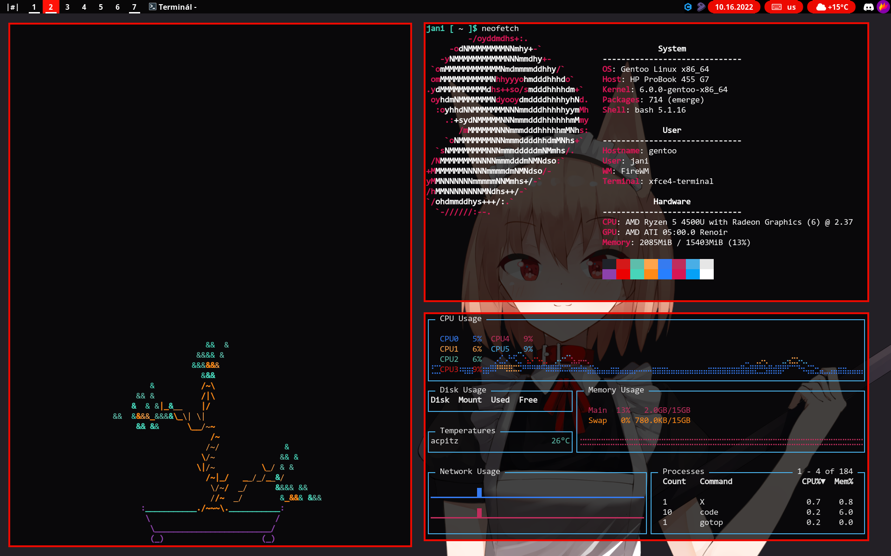

# FireWM
Lightweight Window manager made in C for X <br>
Created as fork of [DWM](https://dwm.suckless.org/)

### dependencies
* Xlib
* Xinerama
* fontconfig
* yajl
* Imlib2
* json-c

### installation
Edit config.mk to match your local setup

after you are done with that
it's time to compile

```sh
sudo make clean install
```
to make editable config without recompilation

```sh
make config
```

### starting

Add the following line to your .xinitrc to start dwm using startx:

```sh
exec firewm
```

## Screenshots


## Known bugs
Button for changing layouts doesn't work

## Changelog
Do I even know? 💀

